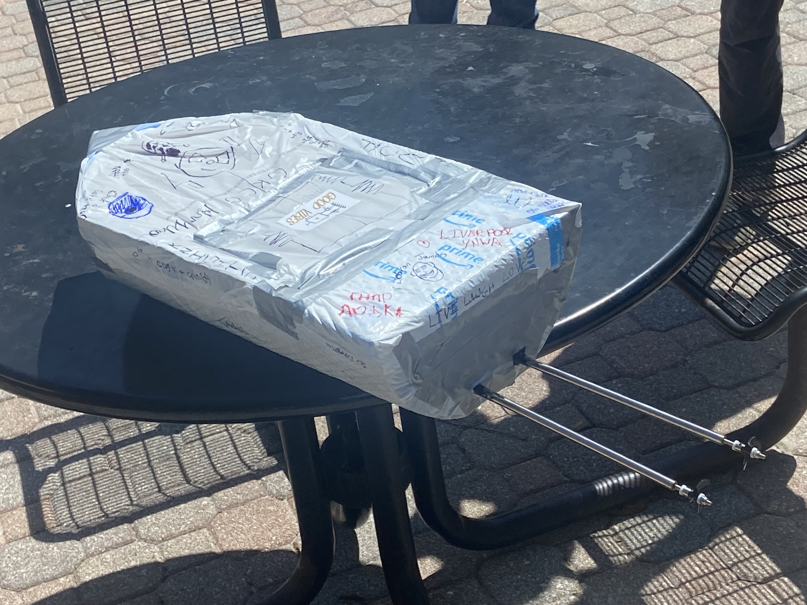

# GNORBoat
> 2025 Great Naval Orange Race Boat Development

## 🧐 About 
This is a repository for a school project in which a water vessel must travel across a fountain autonomously. Our boat used a twin motor differential drivetrain as opposed to a rudder. Using a gyroscope and arduino nano, the boat propelled itself along a predefined course.

## 💫 Demo

## ▶ Parts List
- Arduino Nano 
- MPU6050
- 2 20A Electronic Speed Controllers
- 2 1000KV Brushless DC Motors
- 2 Drive Shafts and Propellers
- 3S 50C 1300mAh 11.1V Lipo Battery
- 3D printing filament for hull
- Tape

## :phone: Contact
Tai Williams - twilliamsa776@gmail.com
